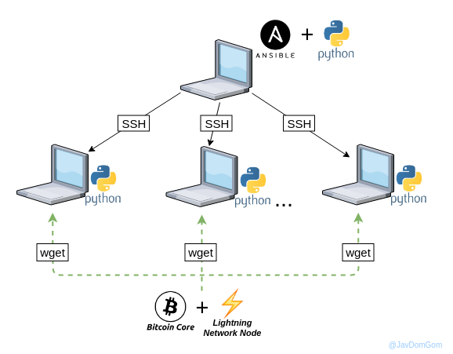

# Ansible playbook to install a Bitcoin Lightning Network node

## Getting Started
With this playbook you can install the Bitcoin Core client and a Node Lightning Network in "N" computers from a single point of execution.

## Requirements

### Control Machine
- GNU/Linux, Unix or OS X operative system. Windows isn’t supported.
- [Ansible 2.7](https://docs.ansible.com/ansible/latest/installation_guide/intro_installation.html#latest-releases-via-pip)
- Python 2 (versions [2.6](https://www.python.org/download/releases/2.6/) or [2.7](https://www.python.org/downloads/release/python-2715/)) or Python 3 (versions [3.5](https://www.python.org/downloads/release/python-350/) and higher).
- SSH protocol to manage machines.

### Managed Node
- GNU/Linux, Unix or OS X operative system. Windows isn’t supported.
- Python [2.6](https://www.python.org/download/releases/2.6/) or higher.
- Internet connection to download software.



## Configure before launch playbook
1. Replace `REPLACE_RPCUSER`, `REPLACE_RPCPASSWORD` and `REPLACE_PRUNE` strings in bitcoin_core/vars/`main.yml` file for your choice, for example:
  ```bash
  download_destination: '/var/tmp'
  bitcoin_core_version: '0.17.1'
  bitcoin_core_file: 'bitcoin-{{bitcoin_core_version}}-arm-linux-gnueabihf.tar.gz'
  bitcoin_core_sha256: 'sha256: aab3c1fb92e47734fadded1d3f9ccf0ac5a59e3cdc28c43a52fcab9f0cb395bc'
  bitcoin_core_path: '/opt/bitcoin'
  bitcoin_core_config_path: '~/.bitcoin'
  bitcoin_core_rpcuser: johndoe
  bitcoin_core_rpcpassword: abcd1234
  bitcoin_core_prune: 50000
  ```

2. Replace `REPLACE_EXTERNAL_IP`, `REPLACE_RPCUSER` and `REPLACE_RPCPASSWORD` strings in lightning_network_daemon/vars/`main.yml` file for your choice, for example:
  ```bash
  download_destination: '/var/tmp'
  lnd_version: 'v0.5.2-beta'
  lnd_file: 'lnd-linux-armv7-{{lnd_version}}.tar.gz'
  lnd_sha256: 'sha256: 9adf9f3d0b8a62942f68d75ffe043f9255319209f751dee4eac82375ec0a86cd'
  lnd_path: '/opt/lnd'
  lnd_config_path: '~/.bitcoin'
  lnd_externalip: 86.53.156.171
  lnd_rpcuser: johndoe
  lnd_rpcpassword: abcd1234
  ```
3. Write your own `inventory.ini` file with all your hosts, IP addresses and other custom variables like alias, for example:
  ```bash
  [all]
  raspberryPi_000 ansible_host=192.168.1.100 alias=lnd_000
  raspberryPi_001 ansible_host=192.168.1.101 alias=lnd_001
  raspberryPi_002 ansible_host=192.168.1.102 alias=lnd_002
  ...

  [LightningNetworkNodes]
  raspberryPi_000
  raspberryPi_001
  raspberryPi_002
  ...
  ```

4. Launch this Ansible playbook to automatically install and configure a Bitcoin Lighting Network node on one or more hosts.
  ```bash
  ansible-playbook -i inventory.ini -u pi --ask-pass main.yaml
  ```
